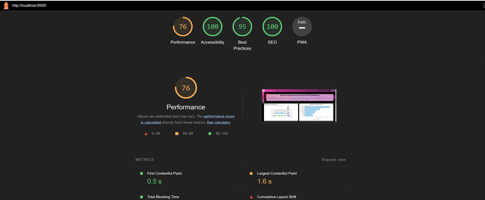

# ADIU Dashboard - Project 1

First project of the ADIU course 2023-2024. Consists of a dashboard that shows the data of the different sensors of a determined dataset, in this case the [Most Streamed Spotify Songs in 2023](https://www.kaggle.com/datasets/nelgiriyewithana/top-spotify-songs-2023).

## Usage

To run the dashboard, you need to have installed the dependencies listed in the `requirements.txt` file. To do so, you can run the following command:

```bash
pip install -r requirements.txt
```

> Note: The deps. used are: `fastapi==0.103.2` `uvicorn==0.23.2` `pandas==2.1.1`

Once you have installed the dependencies, you can run the dashboard with the following command:

```bash
python run.py
```

This will run the dashboard in your local machine, and you will be able to access it through the following URL: [localhost:5000](http://localhost:5000/)

## Technology Stack

- [Python](https://www.python.org/): For the backend and running the dashboard.
- [FastAPI](https://fastapi.tiangolo.com/): For the backend.
- [Pandas](https://pandas.pydata.org/): For the [data](./server/data/spotify-2023.csv) processing.
- [Uvicorn](https://www.uvicorn.org/): For running the FastAPI server.
- [Bootstrap](https://getbootstrap.com/): For the frontend.
- [Highcharts](https://www.highcharts.com/): For the charts.
- [Sqlite3](https://www.sqlite.org/index.html): For the database.

## Bechmarks

The following are the benchmarks of the dashboard using [Lighthouse](https://developers.google.com/web/tools/lighthouse) in the following categories:



To see the full report, you can check the [lighthouse report](./docs/lighthouse-report.html) file.

##  Credits
[Sergi Mayol](https://github.com/Sergimayol)
[Aina Tur](https://github.com/AinaT9)

## License

This project is licensed under the terms of the [MIT license](./LICENSE). See [LICENSE](./LICENSE) for more information.
